# CloudMart — Highly Available Multi-AZ E-Commerce Application on AWS

CloudMart is a highly available three-tier e-commerce application built on AWS to demonstrate production-style cloud architecture, fault tolerance, scalability, secure authentication, asynchronous order processing, and Multi-AZ deployment.

The application provides a public product storefront, authenticated checkout, order tracking, and an administrator workflow for approving or rejecting customer orders.

---

## Architecture

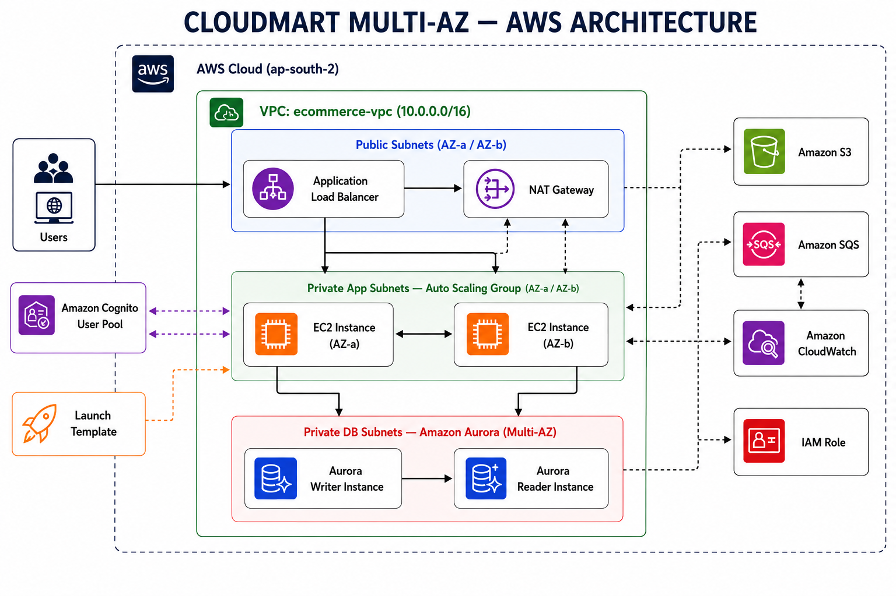

### High-Level Architecture

```text
                         Internet
                            │
                            ▼
                 Application Load Balancer
                     Public Subnets
                    AZ-A         AZ-B
                         │
                         ▼
                  Auto Scaling Group
                    /           \
                   ▼             ▼
               EC2 AZ-A       EC2 AZ-B
               Flask +        Flask +
               Gunicorn       Gunicorn
                   │             │
                   └──────┬──────┘
                          │
          ┌───────────────┼───────────────┐
          │               │               │
          ▼               ▼               ▼
     Aurora MySQL      Amazon S3       Amazon SQS
       Multi-AZ       Product Images    Order Queue
          │
     Writer + Reader

                          +
                   Amazon Cognito
                  User Authentication
                   Users / Admins
```

The VPC spans two Availability Zones and separates public, private application, and private database tiers.

---

## Project Overview

CloudMart demonstrates a complete AWS-hosted e-commerce workflow with:

- Public storefront accessible without authentication
- Shopping cart and checkout
- Amazon Cognito user authentication
- Email confirmation and login
- Role-based access for customers and administrators
- Highly available EC2 application tier
- Application Load Balancer
- Auto Scaling Group
- Multi-AZ Aurora MySQL database
- Amazon S3 product image storage
- Amazon SQS asynchronous order processing
- Background SQS worker
- Admin order approval and rejection
- Customer order status tracking
- IAM-based AWS service access

---

## AWS Services Used

| AWS Service | Purpose |
|---|---|
| Amazon VPC | Isolated network spanning two Availability Zones |
| Application Load Balancer | Public entry point and traffic distribution |
| EC2 Auto Scaling | Maintains highly available application instances |
| Amazon EC2 | Runs Flask/Gunicorn application and SQS worker |
| Amazon Aurora MySQL | Multi-AZ persistent relational database |
| Amazon S3 | Stores product images and deployment artifacts |
| Amazon SQS | Decouples checkout from order processing |
| Amazon Cognito | User authentication and role management |
| AWS IAM | Least-privilege access between AWS services |
| Amazon CloudWatch | Metrics and operational monitoring |
| NAT Gateway | Outbound connectivity for private instances |

**Region:** `ap-south-2` — Asia Pacific (Hyderabad)

---

# Multi-AZ High Availability

CloudMart runs inside a dedicated VPC spanning **two Availability Zones**.

The network contains six subnets:

```text
VPC
│
├── Availability Zone A
│   ├── Public Subnet
│   ├── Private Application Subnet
│   └── Private Database Subnet
│
└── Availability Zone B
    ├── Public Subnet
    ├── Private Application Subnet
    └── Private Database Subnet
```

This architecture prevents the application from depending on a single Availability Zone.

---

## Application Load Balancer

The internet-facing Application Load Balancer acts as the single public entry point.

```text
User
 │
 ▼
Application Load Balancer
 │
 ├────► EC2 Instance — AZ-A
 │
 └────► EC2 Instance — AZ-B
```

The ALB forwards requests only to healthy instances registered with its target group.

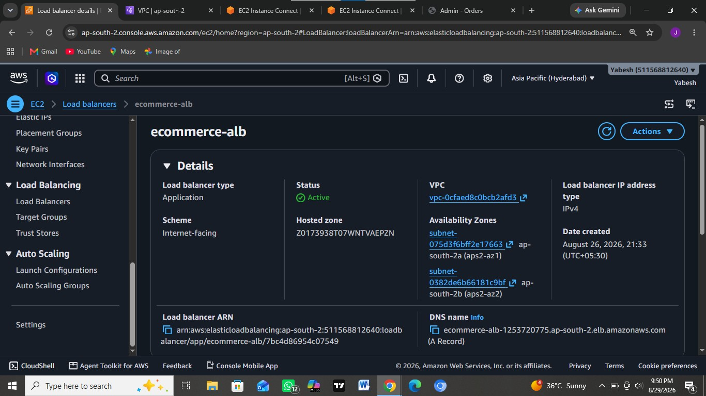

---

## Auto Scaling Group

The application tier runs using an EC2 Auto Scaling Group across two Availability Zones.

The project maintains two healthy application instances and can automatically replace an unhealthy instance.

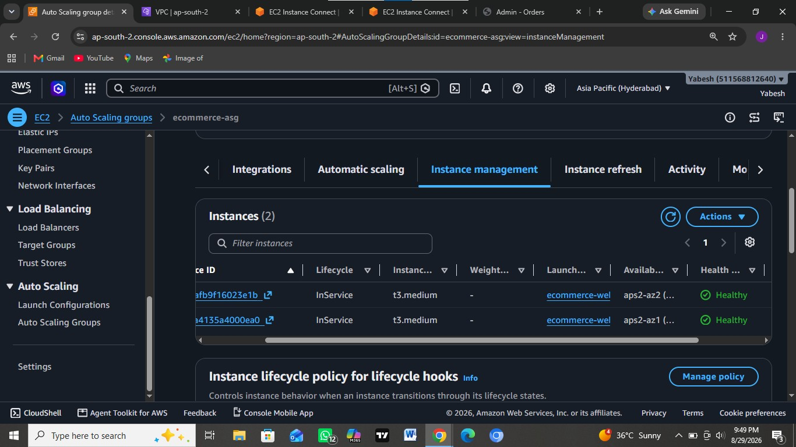

### Target Group Health

Both EC2 instances were verified as healthy and eligible to receive traffic from the load balancer.

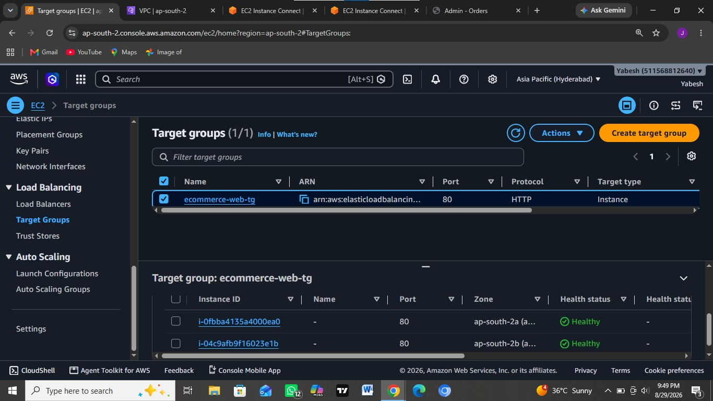

---

## VPC & Subnets

The network uses six subnets across two Availability Zones, providing separate networking for the public, application, and database tiers.

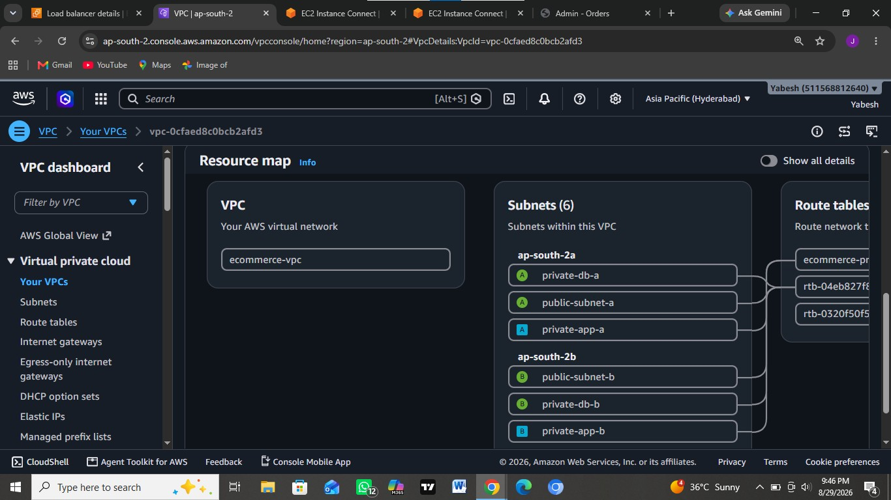

---

## Amazon Aurora MySQL — Multi-AZ

Application data is stored in an Amazon Aurora MySQL cluster.

The database tier includes:

- Aurora writer instance
- Aurora reader instance
- Multi-AZ deployment
- Private database networking

The application tier connects privately to Aurora for product, order, and order-item data.

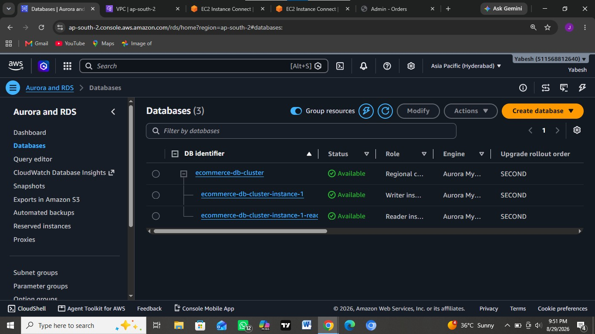

---

## Amazon S3

Amazon S3 is used for:

1. Product image storage
2. Application deployment artifacts under `deploy/app/`

Product images remain private and are delivered to the application using presigned URLs.

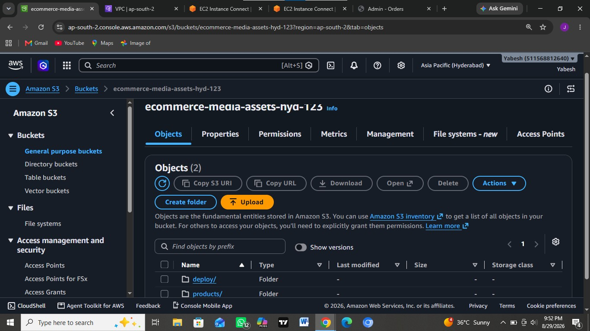

---

## Asynchronous Order Processing with Amazon SQS

Amazon SQS decouples customer checkout from backend order processing.

```text
Customer Checkout
       │
       ▼
    Aurora
Create PENDING Order
       │
       ▼
   Amazon SQS
       │
       ▼
Background Worker
       │
       ▼
Order → PROCESSING
       │
       ▼
Admin Approve / Reject
       │
       ▼
Customer Order Status
```

This allows checkout to complete without waiting for background order processing.

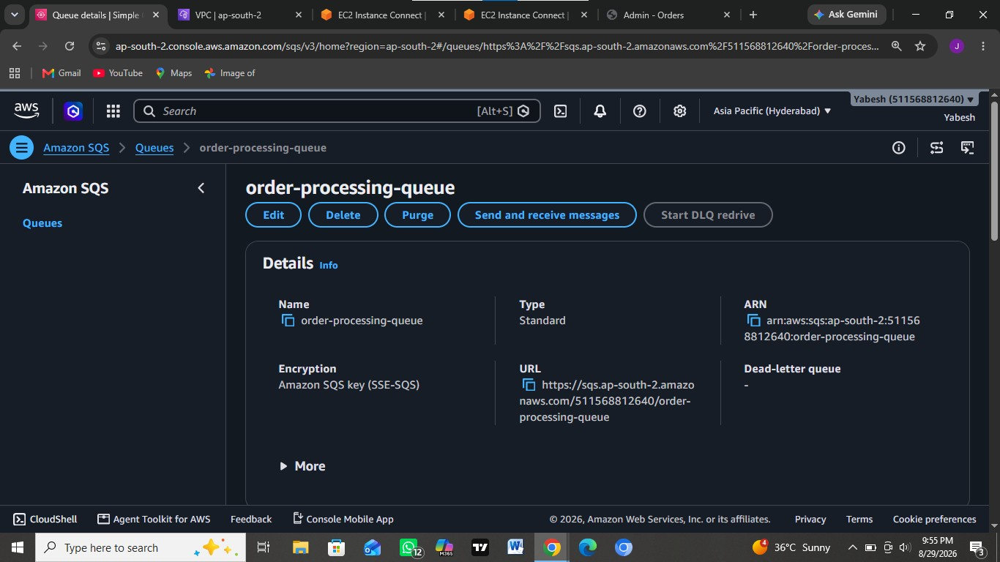

### SQS Monitoring

CloudWatch metrics were used to verify that the queue was receiving and delivering messages.

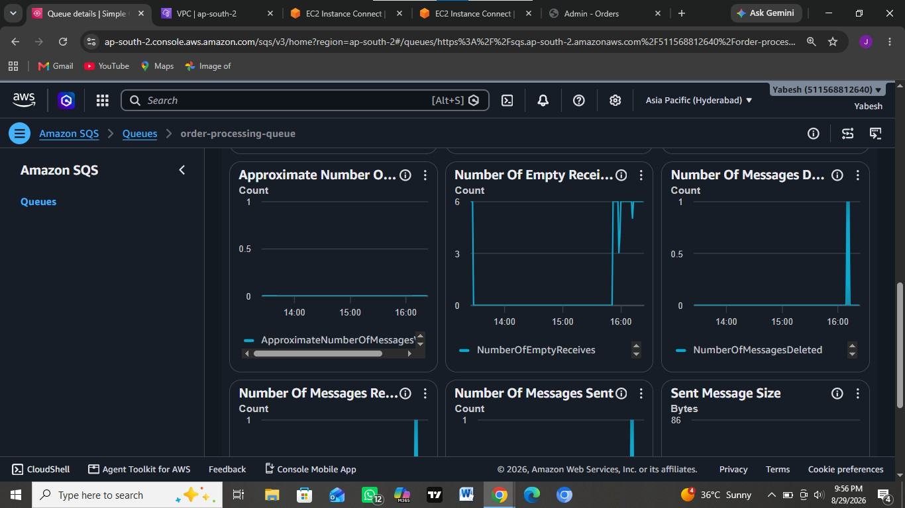

---

## Amazon Cognito Authentication

Amazon Cognito handles:

- User sign-up
- Email confirmation
- Login
- Authentication
- Role-based access

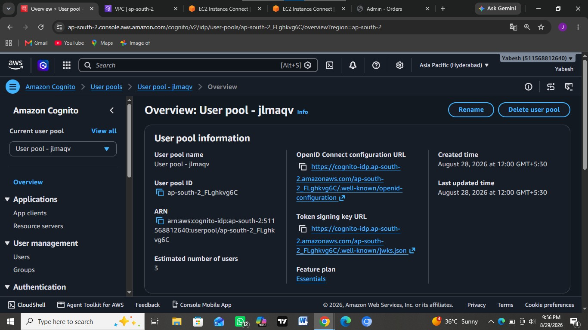

### Admin Role

Administrators are identified through membership in the Cognito `Admins` group.

This allows the application to distinguish between:

```text
Guest
  │
  ├── Browse Products
  │
User
  │
  ├── Checkout
  └── View Orders
  │
Admin
  │
  ├── View Processing Orders
  ├── Approve Orders
  └── Reject Orders
```

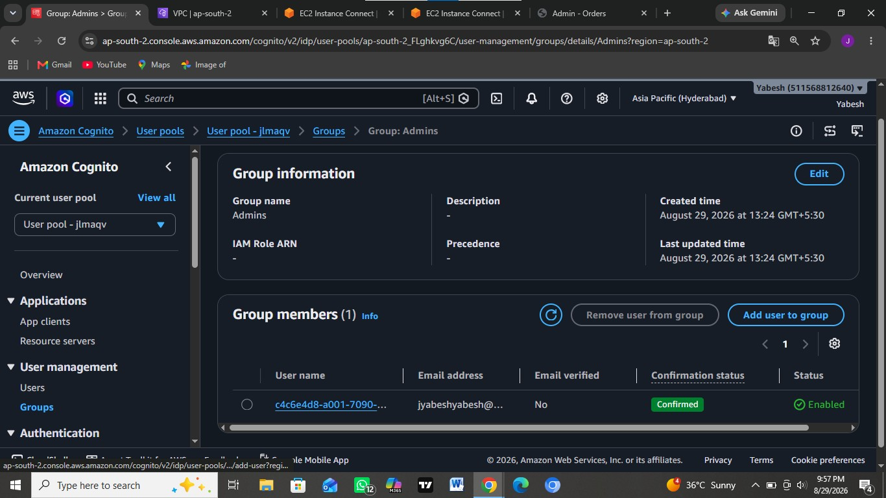

---

# Application Workflow

## 1. Public Storefront

Guests can browse the product catalog without creating an account.

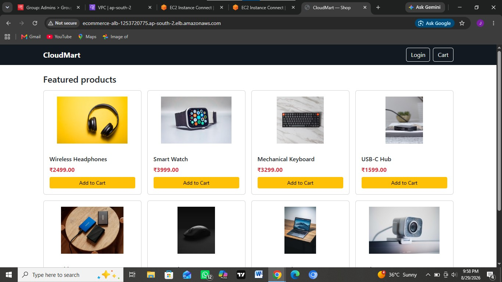

---

## 2. Shopping Cart

Customers can add products and modify quantities before authentication.

---

## 3. Authentication

Authentication is required when the customer proceeds to checkout.

Amazon Cognito handles the login process.

---

## 4. Checkout

After authentication, the customer enters shipping information and places the order.

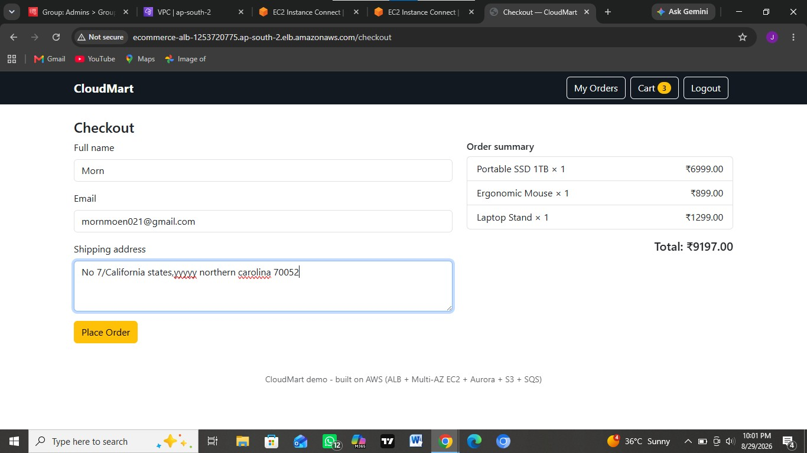

---

## 5. Order Processing

When an order is placed:

```text
Checkout
   │
   ├──► Aurora → PENDING order
   │
   └──► Amazon SQS → Order message
                         │
                         ▼
                  Background Worker
                         │
                         ▼
                    PROCESSING
```

The customer receives confirmation immediately while backend processing happens asynchronously.

---

## 6. Admin Dashboard

Administrators can view orders that have reached the `PROCESSING` state.

They can then:

- Approve an order
- Reject an order

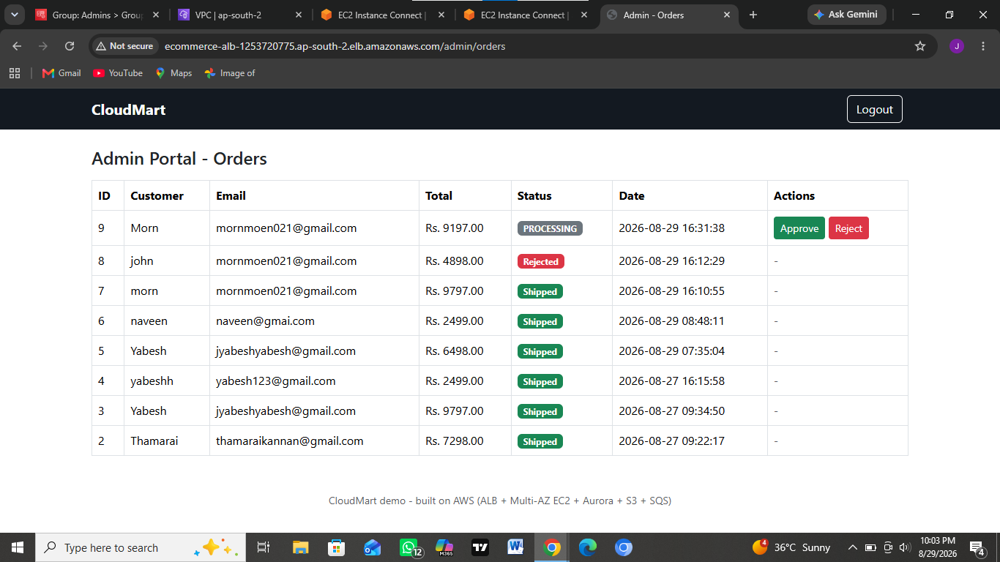

When approved, the order is marked as shipped and the updated status becomes visible to the customer.

---

# Application Services

The application runs two independent Linux `systemd` services.

### Flask Web Application

```text
ecommerce.service
```

Runs the Flask application using Gunicorn.

### Background SQS Worker

```text
ecommerce-worker.service
```

Continuously polls Amazon SQS and processes incoming order messages.

Both services were verified as active and running.

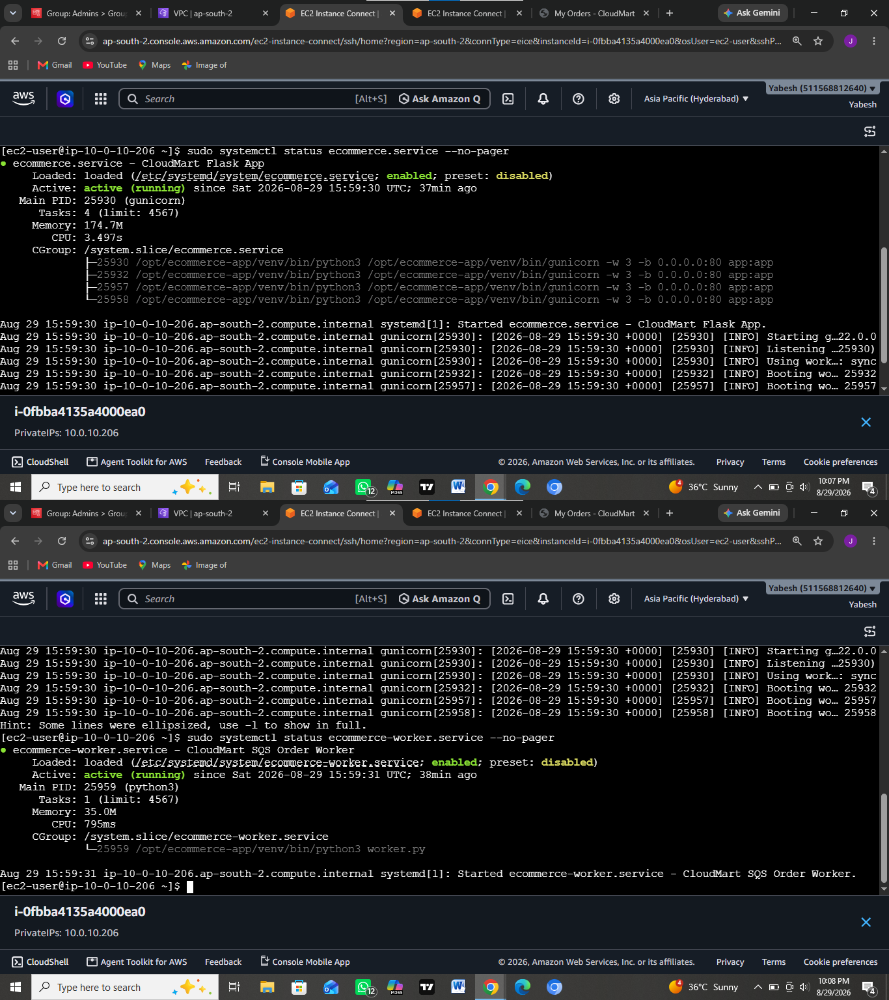

---

# Security Practices

The project applies several AWS security practices:

- Application instances run in private subnets.
- Aurora database instances run in private database subnets.
- Only the Application Load Balancer is internet-facing.
- Private instances use a NAT Gateway for outbound connectivity.
- Amazon Cognito handles passwords and authentication.
- Cognito groups provide server-side role-based access.
- S3 Block Public Access keeps the media bucket private.
- Product images are accessed using short-lived presigned URLs.
- EC2 uses an IAM role for S3 and SQS access.
- IAM permissions are scoped to required resources.
- Database credentials and application secrets are kept outside source control.

---

# Request & Order Flow

```text
                         USER
                           │
                           ▼
                 Application Load Balancer
                           │
                    ┌──────┴──────┐
                    ▼             ▼
                  EC2           EC2
                  AZ-A          AZ-B
                    │             │
                    └──────┬──────┘
                           │
          ┌────────────────┼────────────────┐
          ▼                ▼                ▼
       Aurora              S3              SQS
       MySQL          Product Images       Queue
          │                                  │
          │                                  ▼
          │                          Background Worker
          │                                  │
          └────────────────┬─────────────────┘
                           ▼
                     Order Status
                           │
                           ▼
                     Admin Action
                           │
                           ▼
                   Customer My Orders
```

---

# Project Structure

```text
aws-cloudmart-multiaz-ecommerce/
│
├── README.md
│
├── screenshots/
│   ├── architecture-diagram.png
│   ├── vpc-subnets.png
│   ├── auto-scaling-group.png
│   ├── target-group-health.png
│   ├── application-load-balancer.png
│   ├── aurora-multiaz.png
│   ├── s3-bucket.png
│   ├── sqs-queue.png
│   ├── sqs-cloudwatch-metrics.png
│   ├── cognito-user-pool.png
│   ├── cognito-admin-group.png
│   ├── storefront.png
│   ├── checkout.png
│   ├── admin-dashboard.png
│   └── service-health.png
│
└── doc/
    └── CloudMart AWS Project Documentation.pdf
```

---

# Project Documentation

The complete project documentation is available here:

[`CloudMart AWS Project Documentation.pdf`](doc/CloudMart%20AWS%20Project%20Documentation.pdf)

---

# What I Learned

This project provided hands-on experience with:

- Designing a three-tier AWS architecture
- Building Multi-AZ architectures
- Public and private subnet design
- Application Load Balancing
- EC2 Auto Scaling
- Target group health checks
- Amazon Aurora MySQL
- Amazon S3 private object access
- S3 presigned URLs
- Asynchronous processing with Amazon SQS
- Amazon Cognito authentication
- Role-based access control
- IAM instance roles
- Linux systemd services
- Application health verification
- Designing for high availability and fault tolerance

---

# Key AWS Concepts Demonstrated

`AWS` • `Multi-AZ` • `High Availability` • `Amazon VPC` • `ALB` • `EC2` • `Auto Scaling` • `Aurora MySQL` • `Amazon S3` • `Amazon SQS` • `Amazon Cognito` • `IAM` • `CloudWatch` • `NAT Gateway` • `Private Subnets` • `Three-Tier Architecture`

---

CloudMart was built as a hands-on AWS project to demonstrate how compute, networking, databases, storage, messaging, authentication, and security services can be combined into a highly available e-commerce architecture.
